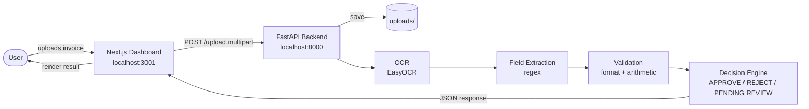
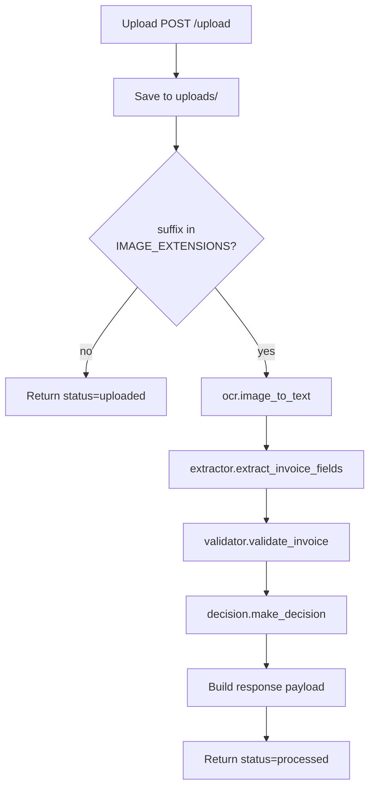
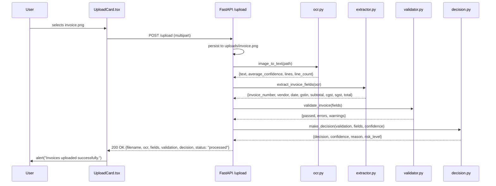

# Finance Flow AI — Architecture

Finance Flow AI is an invoice verification platform. A user uploads an
invoice image through a Next.js dashboard; a FastAPI backend runs OCR,
extracts structured fields, validates the result, and emits an
approve / reject / pending-review decision. The current iteration is
end-to-end on the **backend** (upload → decision) and **UI** (dashboard
with a working upload card and a static recent-invoices table driven by
dummy data).

---

## High-level system overview



The frontend currently only logs the response (`console.log("Uploaded:", result)`)
and shows a generic success alert. Rendering the decision back into the
table is a near-term follow-up.

---

## Technology stack

| Layer        | Technology                                                        |
| ------------ | ----------------------------------------------------------------- |
| Frontend     | Next.js 15 (App Router) · React 18 · TypeScript · Tailwind CSS 4 |
| Icons        | `lucide-react`                                                    |
| Class merge  | `clsx` (`src/lib/cn.ts`)                                          |
| Backend      | FastAPI · Uvicorn · Python 3                                      |
| OCR          | EasyOCR (English) backed by PyTorch                               |
| Image I/O    | Pillow · NumPy                                                    |
| Validation   | Pure Python (regex + GSTN checksum + arithmetic checks)           |
| Tests        | `pytest` · `fastapi.testclient` · `httpx`                         |
| Storage      | Local filesystem (`backend/uploads/`) — no database yet           |

---

## Frontend architecture

The frontend is a single-page dashboard at `/` rendered by the Next.js
App Router.

```
frontend/
├── src/
│   ├── app/
│   │   ├── layout.tsx          # root layout, fonts, metadata
│   │   ├── page.tsx            # dashboard page
│   │   └── globals.css
│   ├── components/
│   │   ├── Navbar.tsx
│   │   ├── StatsCards.tsx
│   │   ├── UploadCard.tsx      # the only piece that talks to the API
│   │   └── RecentInvoicesTable.tsx
│   └── lib/
│       ├── cn.ts               # class-name helper
│       └── dummy-data.ts       # stat cards + recent-invoices fixtures
├── package.json
├── tsconfig.json
└── next.config.ts
```

Key behaviours:

* `UploadCard.tsx` is a client component (`"use client"`) that
  maintains a queue of files in React state, supports click and
  drag-and-drop, and POSTs each file to
  `http://127.0.0.1:8000/upload` as `multipart/form-data`.
* `StatsCards.tsx` and `RecentInvoicesTable.tsx` render from
  `src/lib/dummy-data.ts`. The header comment on that file flags this
  as a placeholder pending wiring to the real API.
* `Navbar.tsx` lists five items (Dashboard, Invoices, Vendors,
  Reports, Settings). Only Dashboard is implemented; the rest are
  placeholder links.
* `cn()` is the only utility in `src/lib/`.

---

## Backend architecture

The backend is a small FastAPI service. The `app/` package holds all
runtime modules; `tests/` holds the pytest suite.

```
backend/
├── app/
│   ├── __init__.py
│   ├── main.py            # FastAPI app, /health and /upload routes
│   ├── ocr.py             # EasyOCR wrapper, image → text + confidences
│   ├── extractor.py       # text → structured fields (regex)
│   ├── validator.py       # structured fields → passed/errors/warnings
│   └── decision.py        # validation + fields + confidence → decision
├── tests/
│   └── test_decision.py   # 12 unit + endpoint tests
└── uploads/               # on-disk store for received files
```

Each pipeline stage is its own module with a single public function,
which keeps them independently testable and replaceable (e.g. swap
EasyOCR for a cloud OCR provider by changing only `ocr.py`).

---

## OCR → Extraction → Validation → Decision pipeline



### 1. OCR — `app/ocr.py`

* Lazy-loads a singleton EasyOCR reader (`get_reader()` is wrapped in
  `lru_cache(maxsize=1)`).
* Reads the image with Pillow, converts to an RGB NumPy array, and
  calls `reader.readtext(image, detail=1, paragraph=False)`.
* Returns `{lines, text, average_confidence, line_count}`. The
  `average_confidence` is the arithmetic mean of every per-line
  confidence and is the value the decision engine consults.

### 2. Field extraction — `app/extractor.py`

`extract_invoice_fields(ocr_output)` walks the joined OCR text with
ordered regex fallbacks:

| Field            | Strategy                                                |
| ---------------- | ------------------------------------------------------- |
| `invoice_number` | "Invoice #", "Inv No", "Bill No", then bare "Invoice:"  |
| `vendor`         | "From:" / "Sold by" / first non-numeric short line      |
| `date`           | Day-Month-Year, ISO, and a few mixed permutations       |
| `gstin`          | Single 15-character pattern with GSTN structure          |
| `subtotal/cgst/sgst/total` | Label-then-number with a tolerant number parser (handles `1,23,456.78`) |

Amounts are normalised to `float`; missing fields are returned as
`None`. There is currently no fuzzy matching — the extractor relies on
clean OCR.

### 3. Validation — `app/validator.py`

`validate_invoice(fields)` produces:

```python
{"passed": bool, "errors": [str, ...], "warnings": [str, ...]}
```

* **Errors (hard failures):** missing `invoice_number`, missing
  `total`, malformed GSTIN, or `subtotal + cgst + sgst` differing from
  `total` by more than `₹1`.
* **Warnings (soft flags):** missing optional `vendor` or `date`, or
  `total ≥ ₹200,000` which the team treats as high-value.

### 4. Decision — `app/decision.py`

`make_decision(validation, fields, confidence)` evaluates rules in a
fixed precedence so hard failures always win over soft ones.

| Decision        | Risk level | Triggered by                                                                                |
| --------------- | ---------- | ------------------------------------------------------------------------------------------- |
| **APPROVE**     | LOW        | `validation.passed`, no warnings, `confidence ≥ 0.85`                                       |
| **REJECT**      | HIGH       | Invalid GSTIN checksum, missing `invoice_number`, amount inconsistency, or `confidence < 0.40` |
| **PENDING REVIEW** | MEDIUM | Policy warning present, `0.40 ≤ confidence < 0.85`, or any optional field missing            |

The response shape is fixed: `{decision, confidence, reason, risk_level}`.

---

## Request / response flow (concrete example)



---

## Folder structure

```
FinancialManager/
├── backend/
│   ├── app/
│   │   ├── __init__.py
│   │   ├── decision.py
│   │   ├── extractor.py
│   │   ├── main.py
│   │   ├── ocr.py
│   │   └── validator.py
│   ├── tests/
│   │   └── test_decision.py
│   ├── uploads/                  # runtime: persisted uploads
│   └── sample_invoice.png
├── frontend/
│   ├── src/
│   │   ├── app/
│   │   │   ├── globals.css
│   │   │   ├── layout.tsx
│   │   │   └── page.tsx
│   │   ├── components/
│   │   │   ├── Navbar.tsx
│   │   │   ├── RecentInvoicesTable.tsx
│   │   │   ├── StatsCards.tsx
│   │   │   └── UploadCard.tsx
│   │   └── lib/
│   │       ├── cn.ts
│   │       └── dummy-data.ts
│   ├── components.json
│   ├── eslint.config.mjs
│   ├── next.config.ts
│   ├── package.json
│   ├── postcss.config.mjs
│   └── tsconfig.json
└── docs/                          # this folder
    ├── API.md
    ├── ARCHITECTURE.md
    ├── DEPLOYMENT.md
    └── DEVELOPER_GUIDE.md
```

---

## What is intentionally *not* in the architecture yet

* No database. Processed invoices are not persisted; only the raw file
  is kept in `backend/uploads/`.
* No auth. Every endpoint is open.
* No `/invoices`, `/stats`, `/vendors`, or `/reports` API routes —
  the navbar links are placeholders.
* The frontend's `RecentInvoicesTable` and `StatsCards` are driven by
  static fixtures in `src/lib/dummy-data.ts`.
