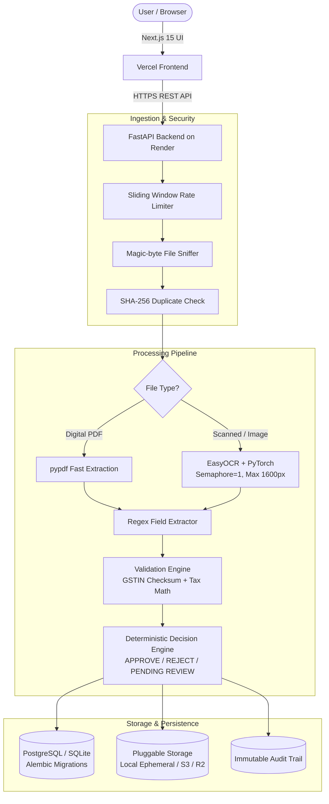

# Finance Flow AI — System Architecture (v2.0.0)

Finance Flow AI is a production-grade automated invoice reconciliation platform designed to operate within free-tier and open-source constraints.

---

## 1. System Overview

```mermaid
flowchart TD
    User([User / Browser]) -->|Next.js 15 UI| Frontend[Vercel Frontend]
    Frontend -->|HTTPS REST API| API[FastAPI Backend on Render]
    
    subgraph Ingestion & Security
        API --> Limiter[Sliding Window Rate Limiter]
        Limiter --> MagicCheck[Magic-byte File Sniffer]
        MagicCheck --> Dedupe[SHA-256 Duplicate Check]
    end
    
    subgraph Processing Pipeline
        Dedupe --> TypeSwitch{File Type?}
        TypeSwitch -->|Digital PDF| PDFEngine[pypdf Fast Extraction]
        TypeSwitch -->|Scanned / Image| OCREngine[EasyOCR + PyTorch<br/>Semaphore=1, Max 1600px]
        PDFEngine --> RegexExtract[Regex Field Extractor]
        OCREngine --> RegexExtract
        RegexExtract --> Validator[Validation Engine<br/>GSTIN Checksum + Tax Math]
        Validator --> RulesEngine[Deterministic Decision Engine<br/>APPROVE / REJECT / PENDING REVIEW]
    end

    subgraph Storage & Persistence
        RulesEngine --> DB[(PostgreSQL / SQLite<br/>Alembic Migrations)]
        RulesEngine --> Storage[(Pluggable Storage<br/>Local Ephemeral / S3 / R2)]
        RulesEngine --> Audit[(Immutable Audit Trail)]
    end
```

---

## 2. Technology Stack

| Layer | Technology | Rationale & Deployment Notes |
| :--- | :--- | :--- |
| **Frontend** | Next.js 15 (App Router), React 18, Tailwind CSS | Deployed on **Vercel Hobby Tier**. Blazing fast SSR/CSR with modular route layout. |
| **Backend API** | FastAPI, Uvicorn, Python 3.11+ | Deployed on **Render Free Web Service**. Asynchronous event loop with non-blocking worker threads. |
| **Persistence** | PostgreSQL (Neon / Supabase / Render Postgres) | Schema managed via **Alembic migrations** (`alembic upgrade head`). Pre-ping connection pooling enabled. |
| **Storage** | Local disk or AWS S3 / Cloudflare R2 | Abstracted via `StorageProvider`. Tracks `is_ephemeral` so callers know if files persist across container restarts. |
| **OCR & Text Extraction** | EasyOCR + PyTorch (CPU) & `pypdf` | Dual-engine approach. Digital PDFs bypass PyTorch completely; images downscaled to 1600px to maintain memory $< 512$ MB. |
| **Security** | PBKDF2-HMAC-SHA256, PyJWT | FIPS-compliant standard library cryptography; no native C extensions required. |

---

## 3. Core Processing Pipeline

### 3.1 Ingestion & File Sniffing
1. **Streaming Size Guard:** Uploads stream in 1 MB chunks up to `MAX_UPLOAD_BYTES` (10 MB). Oversized uploads abort immediately with `413 Content Too Large`.
2. **Magic-Byte Sniffing:** Checks actual file headers (e.g. `%PDF-` for PDF, `\x89PNG` for PNG, `\xff\xd8\xff` for JPEG). Rejects spoofed extensions with `415 Unsupported Media Type`.
3. **Deduplication:** Computes SHA-256 digest of file bytes. If the hash matches an existing record in the organization, `is_duplicate: true` is flagged and recorded.

### 3.2 Dual-Engine Extraction
* **Digital PDF Extraction (`pypdf`):** If a digital PDF is uploaded, text streams are parsed directly from font tables. This operates in milliseconds, consumes $< 20$ MB of RAM, and completely bypasses PyTorch.
* **Scanned Image OCR (PyTorch + EasyOCR):** For raster images:
  * An `asyncio.Semaphore(1)` ensures only one OCR job executes at any moment, avoiding multi-threaded memory spikes.
  * Images exceeding 1600px in width or height are downscaled using high-quality bilinear interpolation.
  * Inference executes under `torch.no_grad()`, followed by explicit `gc.collect()`.

### 3.3 Validation & Business Rules
* **Field Extraction:** Regex patterns extract Invoice Number, Vendor Name, GSTIN, Date, Subtotal, CGST, SGST, and Total.
* **GSTIN Mod-36 Verification:** Computes the official 15-character Goods and Services Tax Identification Number checksum digit.
* **Tax Arithmetic:** Verifies that $\text{Subtotal} + \text{CGST} + \text{SGST} = \text{Total}$ within $\pm 0.05$ variance.

### 3.4 Deterministic Decision Engine
Decisions are strictly rule-based and deterministic:
* **`APPROVE` (`LOW` risk):**
  * Validation passed with zero errors or warnings.
  * Average OCR confidence $\ge 0.85$.
* **`REJECT` (`HIGH` risk):**
  * Invalid GSTIN checksum or format.
  * Missing invoice number.
  * Tax arithmetic discrepancy.
  * OCR confidence $< 0.40$.
* **`PENDING REVIEW` (`MEDIUM` risk):**
  * Missing optional fields (e.g., date).
  * Company policy warnings (e.g., invoice total exceeds high-value threshold).
  * Moderate confidence ($0.40 \le c < 0.85$).

> **Policy on LLMs:** Large Language Models are strictly restricted to optional unstructured field extraction aids. LLMs are never permitted to make approval or rejection decisions.

---

## 4. Human-Review Queue & Audit Trail

1. Invoices landing in `PENDING REVIEW` are surfaced in the dedicated frontend **Review Queue** (`/invoices?decision=PENDING+REVIEW`).
2. An authorized reviewer submits a final determination (`APPROVE` or `REJECT`) along with mandatory audit notes.
3. Every state transition (System Upload, Human Review, Reprocessing) writes an immutable record to the `audit_logs` table containing:
   * Action name (`UPLOAD_PROCESSED`, `HUMAN_REVIEW`)
   * Performed by (user email or system)
   * Previous state and new state
   * Timestamp (UTC) and contextual notes

---

## 5. Storage Architecture

Render free-tier web services operate on ephemeral file systems. When a service spins down or redeploys, locally saved files in `uploads/` are erased.

To guarantee zero misrepresentation and reliable persistence:
* The backend exposes `storage_type` (`local` vs `s3`) and `is_ephemeral` (`true` vs `false`) on invoice records.
* In local mode, the UI explicitly discloses that file binaries are ephemeral.
* In production, setting `STORAGE_BACKEND=s3` together with S3/Cloudflare R2 credentials persists files permanently without incurring server disk costs.
